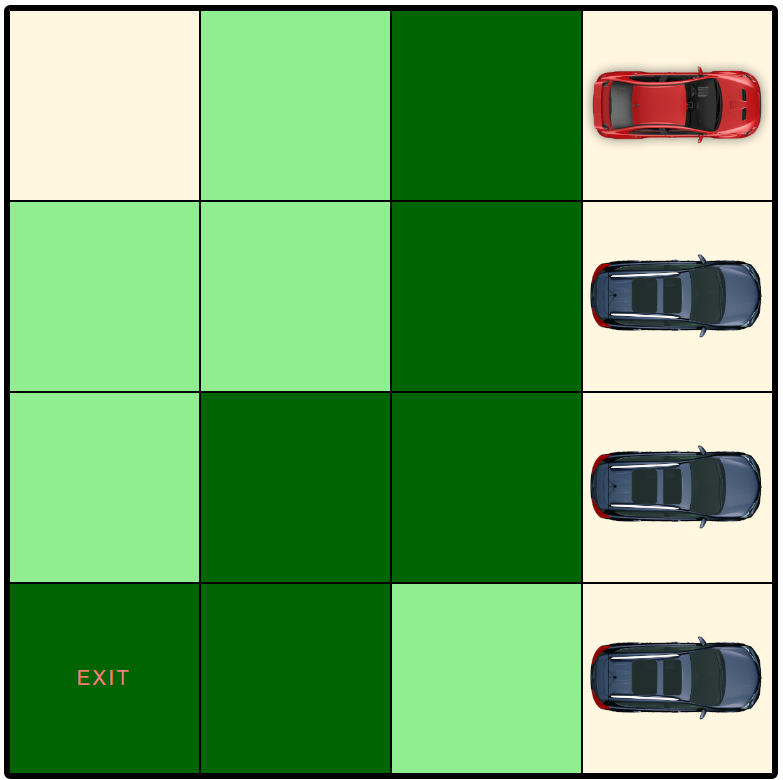

# Smart parking

Smart parking vizualisation application using A\* algorithm

Start

Best path found

# Todos

- [x] Fix bug in add cars node line 281
- [x] Fix bug solver will be still running even there's no car
- [x] Add randomize which place several cars in random location
- [x] Place cars in their supposed place based on exit time
- [x] Optimize randomize function
- [ ] From path move cars
- [ ] Implement puzzle parking

# Contact developer

ahmad.muslih22@gmail.com
